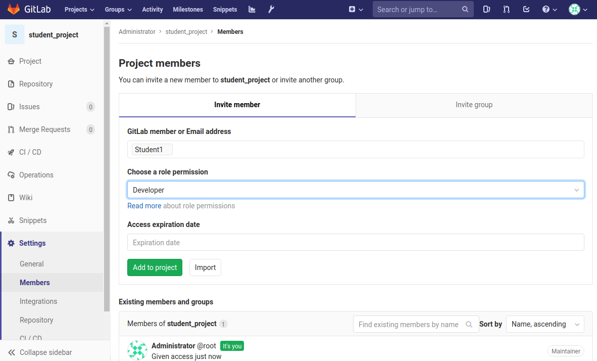

# Git
Git has become a necessity in the open-source ecosystem.  Git is a distributed
version control system meaning that it helps software projects to remotely
collaborate on their project and track changes to their source code.  It is not
the only version control system in use but has become the defacto standard 
among open-source projects.  In order to prepare our students for 
participation in various group projects, we will introduce them to Git by 
covering some of the basic commands and uses.

## Setup
There are a number of ways that you could approach using and teaching Git.  
I have found that most commonly, Git will be used to push to and pull from a 
remote repository; the most popular being (https://www.github.com)[https://www.github.com] 
and (https://www.gitlab.com)[https://www.gitlab.com].  Both should allow you to 
setup free accounts and public repositories to aid in the teaching of the 
material.  It is by far the simplest method in my opinion and will get you up 
and running very quickly. It does however, require different email accounts for
each student

## For the Brave and Slightly Crazy
For my own edification, I decided to take a different approach and download the
GitLab docker image and run that on my Linux machine.  This however, could have
easily been done on a Raspberry Pi as well.  The only criteria that I am aware
of is the server has to be Linux based, running docker and docker-compose, and 
can be reached from other systems over the network.  Specifically, I suggest 
making sure ports 443, 80, and 22 are reachable.  Additionally, if you were so
inclined, you could stand up your own GitLab server. Directions can be found at
[gitlab.com](https://about.gitlab.com/install/).

To launch the included [./docker-compose.yml](./docker-compose.yml) file type: 
`docker-compose up -d` from within the directory containing this file.

> **WARNING**: port 443, 80, and 22 may already be bound.

You'll need to shut down the conflicting services or launch on another machine.
While the ports on the docker image are configurable, to keep the git labs 
standardized, I decided to shut my own services down.  Specifically, I was 
already running OpenSSH and therefore had to run `sudo systemctl stop sshd`.

1. This will download the docker image and fire it up.  It may take some time
depending upon your download speeds.
1. You can run `docker ps` to validate that the image is running.
1. In the future, you can run `docker ps -a` find the gitlab instance, and run
   `docker start NAME` inserting the actual name of the container for *NAME*.
1. Add the following line to /etc/hosts: `127.0.0.1     gitlab.scoa.org`
1. Launch a web browser and browse to
   [https://gitlab.scoa.org](https://gitlab.scoa.org).
1. If this is your first time launching the docker image, it will prompt you
   to create a password for the *root* account.

### Create Users
1. Once logged in as *root*, click *Add people*.
1. I created student1, student2, etc...  You can then go in and edit those
   users to set their initial passwords.
1. Once those users log in, they will be prompted to change their passwords.

### Generate SSH Keys
Each user should generate ssh keys to add to their profiles using the included
guide: (ssh-GitLab.pdf)[./ssh-GitLab.pdf]

`ssh-keygen -o -b 4096 -C student1@scoa.org`

#### Windows 10
Windows 10 now comes pre-installed with OpenSSH which you'll need to generate
ssh keys.  However, it does not come with Git.  You can open a browser and
navigate to [https://git-scm.com/downloads](https://git-scm.com/downloads) to
download Git and install it.


#### Linux
It is very rare to not have OpenSSH and Git already installed on a modern Linux
distribution.  If for some reason it is not, it's probably a `yum install`, `dnf
install`, or `apt install` away.

### Generate GitConfig
The gitconfig file tells git various settings to use.  The below settings 

```
git config --global user.name "Student1"
git config --global user.email "student1@scoa.org"
```

Additionally, I also prefer setting no fast forward.  When you *MERGE* back
into master, depending upon how git is configured, it will typically condense
log history.  In order to preserve this, I put the following in my gitconfig:

```
git config --global merge.ff=false
```

> *WARNING*: This may not work on the Windows platform.

### Hosts
Systems connecting to the instance of  Gitlab running in docker will also want 
to ensure that their hosts file is updated with the correct IP for the domain
you used (gitlab.scoa.org in this case). 

> The following steps are only required if you are browsing to addresses that 
do not currently exist within DNS (because you're running a local GitLab 
instance in docker). 

#### Windows
One way to update windows is to right click the command prompt and select *run
as administrator*.  Then navigate to c:\Windows\System32\drivers and then
enter: `notepad.exe hosts`.  This will allow you to edit the hosts file.  Add
the appropriate entry:  `IP_ADDRESS_OF_SYSTEM_RUNNING_GITLAB  gitlab.scoa.org`

#### Linux
From the CLI, edit the hosts file /etc/hosts with the editor of your choice:
`sudo vi /etc/hosts`

## Account Setup
Create student accounts on either Github.com or on the Gitlab instance you are 
hosting with Docker.  Ensure all students can log into an account and upload 
SSH keys. Click *settings* under the user drop-down in the upper right
hand corner of Gitlab:


#### SSH Keys
Students should copy out the contents of their public key they created
earlier and paste it in on the SSH settings page.


## Repository Setup
Create a project either from the main page when you log in or from the drop 
down as seen here:


Give the project an appropriate name, make it public for simplicity, and
initialize it with a README.md to ensure the repository has something to
actually clone.


Add the students to the project as *developers* to ensure they can interact
with it.  This can be done by selecting *settings* on the left-hand side after
the project has been created.



#### Protected
By default, the *master* branch is protected and therefore, only certain people
can merge or delete this branch.  For simplicity, we're going to open it up to
any developer can merge with it.

As the administrator (root), select the repository and click *Repository* on
the right hand side.  Now select *Branches*.  You should see that the master
branch is protected but a link to *project settings* is above it.  Click on
*project settings*:


Expand *Protected Branches*.  The master branch should be listed toward the
bottom.  Set *Developers + Maintainers* for both *merge* and *push* and click
*Unprotect*:


Now anyone listed as a Developer or Maintainer for this repository will have
full control of the master branch.

---
:copyright: 2019 STEM Club of America
