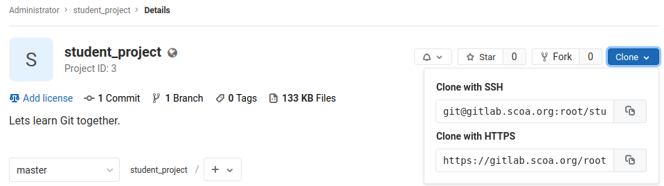

# Git Lab
The following lab file will be used to direct students in using Git.

## Clone
Students should be directed to the URL of the repository that was created
during setup and shown where to click to copy the ssh commands to their 
clipboard for cloning.



Students should return to the command line and make a folder and clone into it.

#### Windows
```
cd c:\Users\USERNAME\
mkdir projects
cd projects
git clone git@gitlab.scoa.org:student1/git_fun.git
cd git_fun
```

#### Linux
```
cd ~/
mkdir projects
cd projects
git clone git@gitlab.scoa.org:student1/git_fun.git
cd git_fun

```

Check the status: `git status`

This should show that you are on branch *master* and that you are up-to-date
with *origin/master*

## Branch
Students could modify the master branch directly and you will often see this
done in single user projects.  However, this is bad practice and should be
avoided whenever a project may involve more than one developer.  We will
encourage each student to only develop in separate branches.

Create New Branch:

```
git branch -a NEW_BRANCH_NAME
git checkout NEW_BRANCH_NAME
```

## Create a file
1. Open a text editor and create a file
1. Have the students put whatever they want in the file
1. Save the file in the folder they cloned as their name

Check the status: `git status`

> What students should see is the file they just created is *untracked*.

#### Stage the file
Add the file to the staging area: `git add FILENAME`

Check the status: `git status`

> Students should see that there are changes waiting to be commited.

#### Commit the file
When commiting, comments should be short but descriptive to indicate what the
actual commit does.

Commit the file: `git commit -m 'Create file FILENAME.'`

> *WARNING*: The Windows platform needs double quotes around the message.

Check the status: `git status`

> Students should see that there is nothing to commit because the file has been 
commited into their local repository.

#### Edit the file
1. Open the file in an editor
1. Add a line
1. Change a line
1. Remove a line
1. Save and close the file

Check the status: `git status`

> Students should see the file has been modified but is not staged for commit.

Check differences: `git diff`

> Students should see the lines that have changed.

#### Stage the file
Add the file to the staging area: `git add FILENAME`

#### Commit the file
Commit the file: `git commit -m 'Add additional lines to file FILENAME..'`

Check the status: `git status`

> Students should see that there is nothing to commit because the file has been
commited into their local repository.

## Prepare to Merge Branch
At this point, we are ready to begin the process of merging our changes back to
the master branch.

Move back to master: `git checkout master`

Ensure your master branch is up-to-date with remote: `git pull origin master`

What this accomplishes is a *fetch* from origin and a *merge* into master.

What is origin: `git config --list`

> origin should be listed as the original Github URL the students cloned from.

## Merge Branch
`git merge --no-ff NEW_BRANCH_NAME -m 'Merging in NEW_BRANCH_NAME.'`

> *WARNING*: The Windows platform needs double quotes around the message.

If all goes well and there are no conflicts, lets push it up to the server.

`git push origin master`

I also like to push up my branch so that if I wanted to clone it down to
another machine if needed.

`git push origin NEW_BRANCH_NAME`

## Pull down changes
Once all students have gotten a chance to make their changes, *merge* back to
master, and *push* it up to the server, have them *pull* updates.

`git pull origin master`

This will pull down all of the files that were created by other students and
merge them into your master branch.

## Look at the Git History
Every commit captures who made the commit, when they made it, what the message
was, and a cryptographic hash of the repository to it prove that it wasn't
tampered with after the fact.

Display full log: `git log`

Display one commit per line: `git log --oneline`

Have the students pick a file and see who edited the lines in it: `git blame FILENAME`

## Experimentation
Allow the students to Branch, make edits or create files, add and commit, merge 
back into master, and push their changes back up to the server.

---
:copyright: 2019 STEM Club of America
