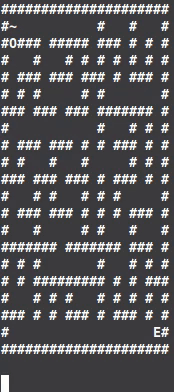

# Maze Solver
In this lab, we will programmatically figure out how to solve an ASCII maze. We
will not apply any optimizations such as using a shortest path first algorithm
but will instead perform a quasi depth first search.

.

## Maze generation
This [link](https://www.dcode.fr/maze-generator) was used to generate the maps.
The maps were further modified to close them in completely and place a start
`S` point as well as end `E` point.

### Sample Maze
```
###########
#S  #     #
# ##### ###
# #       #
# ### #####
#       # #
# ##### # #
# #   #   #
### ##### #
#        E#
###########
```

* Maze is completely closed in.  
* Walkways are represented by spaces.  
* Start is identified by a capital `S`.
* End is identified by a capital `E`.

## Maze Class API

### Create Maze Object
`maze = Maze(PATH)` - Requires a valid path to a maze.

### Get Start
```
    def get_start(self):
        '''
        get_start() -> tuple

        Returns a tuple of the row and column numbers that identifies where 'S'
        is in the maze.
        '''
```

### Get Position Contents
```
    def get_point(self, row, col):
        '''
        get_point(int, int) -> str

        Returns the character at the row and column or None if not found.
        '''
```

### Print Maze
```
    def __str__(self, visited=None, curr_pos=None):
        '''
        __str__(set=None, tuple=None) -> str

        Given a set of coordinates and current position, print the current
        state of the maze.  Otherwise, just print the maze.
        '''
 ```

## Class Solver API

### Create Solver Object
`solver = Solver(maze)` - Requires a maze object.

### Search
```
    def search(self):
        '''
        _perform_search() -> NoneType

        Continues to move around until all all nodes have been visited.
        '''
```

### Query Quadrants
```
    def _query_quadrants(self):
        '''
        _query_quadrants() -> NoneType

        Peers into the four coordinates around the current position.
        '''
```

### Update Seen
```
    def _update_seen(self, row, col):
        '''
        _update_seen(int, int) -> NoneType

        Checks the position and updates seen if position is empty.
        '''
```
### Update Position
```
    def _update_pos(self, row=None, col=None):
        '''
        update_pos(int, int) -> NoneType

        Updates current position.
        '''
```

### Print Current Maze
`print(solver)` - calls `__str__` of maze object and returns string of maze

 ---
:copyright: 2019 STEM Club of America
